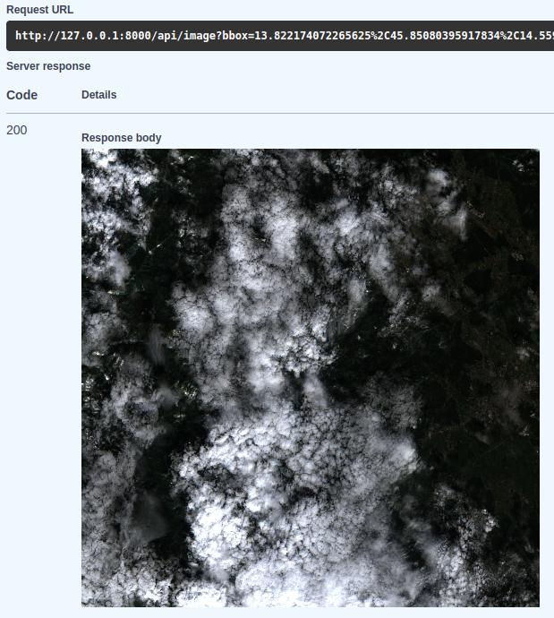
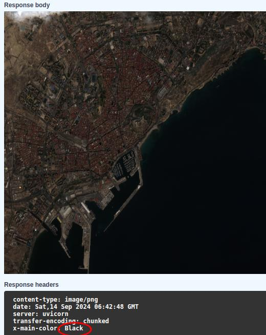
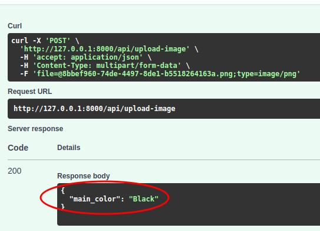

# API Documentation

This document provides detailed information about each endpoint in the Sentinel Image Processing API, including example outputs.

## 1. Get Sentinel Image

Endpoint: `GET /api/image?bbox=min_lon,min_lat,max_lon,max_lat`

This endpoint retrieves a Sentinel-2 image for the specified bounding box.

Example output:

## 2. Get Sentinel Image with Color Analysis

Endpoint: `GET /api/image-with-color?bbox=min_lon,min_lat,max_lon,max_lat`

This endpoint retrieves a Sentinel-2 image for the specified bounding box and performs color analysis.

Example output:

Note: The main color is included in the `X-Main-Color` response header.

## 3. Upload and Analyze Image

Endpoint: `POST /api/upload-image`

This endpoint allows you to upload an image and receive color analysis results.

Example output:

## Using the API

For detailed instructions on how to use these endpoints, please refer to the [Usage section in our main README](../README.md#usage).
